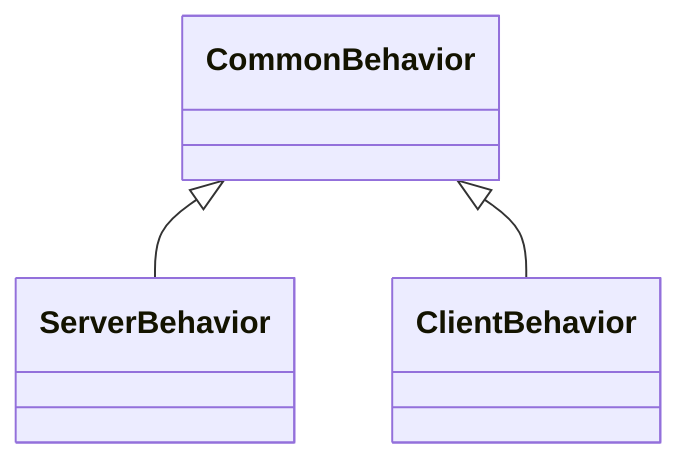

# Tutorial Step 6: Connection-based I/O

The example application in [Step 5](./step_5.md) was the first foray into
Internet Protocol (IP)-based networking via the User Datagram Protocol (UDP).

## Discussion of TCP vs. UDP

The primary attraction of UDP/IP is its simplicity: applications are free to
send and receive packets with (relatively) little setup required. What's more,
with the basic UDP communication unit being a packet (or "datagram"),
applications reap built-in coherent message exchanges without having to resort
to other mechanisms to positively determine message bounds, such as those
required from pure byte streams (see the discussion covering the
[`onSerialInput()` method in Step 3](./step_3.md#application-specific-logic)).

Use of UDP/IP is not all "peaches and cream," though. By far the most glaring
shortcoming of this protocol is its design choice to be a "best effort"
transport, where the network stacks in between the communicating nodes only make
a single attempt at transporting a packet across. If that attempt fails, for
whatever reason, the packet, and its information, is lost. In some cases, the
losses incurred from UDP/IP use may be deemed acceptable. In others, application
logic may step in to enhance reliability using meta-traffic (or "out-of-band"
messaging, as it is sometimes known). When neither of those options is feasible,
the next available route is to use a transport that brings some built-in
reliability features, like the Transport Control Protocol over IP (TCP/IP).

TCP/IP brings reliability with built-in receipt checks and retransmission
features. One big difference when compared to UDP/IP is its design choice to
model communications as point-to-point links between two nodes. In UDP/IP, a
host is free to use its single UDP communication port (or "socket") to exchange
information with several hosts. In TCP, once a link is established, only the two
endpoints of the link are able to exchange data. Communication to nodes outside
of that point-to-point pair is only possible by creating a new link between the
nodes. Furthermore, TCP/IP imposes roles on the two logical points in the
communication link: one point must act as a "server," and the other must act as
a "client." The names may carry the implication that one node is meant to
primarily serve content, while the other is meant to consume, but that is not
always true. The "server" and "client" roles only have a direct bearing during
the point-to-point link setup: the "server" waits for incoming connections
initiated by "clients." Once the point-to-point link is established between the
two, information is free to flow in either direction.

Another big difference between TCP/IP and UDP/IP is how information flows. In
UDP/IP, information flows in bounded messages, or "datagrams." When one node
sends a datagram, the receiving node either receives the entire datagram, or
none of it. There may be fragmentation occurring in between as required by IP or
the media transport layer (e.g., Ethernet), but the UDP/IP stack takes care of
re-assembling the datagram before making it available to the receiver. In
TCP/IP, information flows as a byte stream, similar to a serial port. The entire
contents of a message sent by one end of the point-to-point link should arrive
at the other end, but it may arrive in fragments. Applications must be ready to
handle such fragmentation.

## Application Design

This example will create a Foundation application that can assume either the
role of the "client" or the "server" depending on what command-line arguments
are passed by the user. Similar to [Step 5](./step_5.md), two unique instances
of the same application can serve as a test environment. The overall design will
see the application emit a message on a periodic timer once the point-to-point
link is established, with the receiving end logging receipt of the message. The
design begins to diverge between the two "identities" of the application based
on the assigned role:

* The application assigned the "server" role will set up a server socket to
  listen for a "client" connection. Once a connection is established, the server
  socket will stop accepting connections and the application will transition to
  the common behavior.
* The application assigned the "client" role will attempt to initiate the
  connection with the "server." Again, once a connection is established, the
  application will transition to the common behavior.

## Bootstrap the Project Tree

This example is quite different in design when compared to all others. Thus, the
best way to bootstrap the project tree is to start from the baseline skeleton
provided by the Foundation source tree, similar to [Step 1](./step_1.md). Giving
the project folder the name `TutorialStep6`, with the `FOUNDATION_ROOT`
environment variable pointing to the root folder of the Foundation tree:

```console
$ mkdir TutorialStep6
$ cd TutorialStep6
$ rsync -auv ${FOUNDATION_ROOT}/examples/SampleAppSkeleton/ .
```

The portions of the code copied over that will be customized for this tutorial
step are:

* The project build configuration file `CMakeLists.txt`
* The application main function
* The application delegate

## Project Build Configuration

Similar to the other examples, this example project must be given a unique name.
Furthermore, the project dependency list must be updated to include support for
TCP networking. Edit the project metadata in the `CMakeLists.txt` `project()`
command as follows:

```diff
- project(SampleApp LANGUAGES CXX)
+ project(TcpInteract LANGUAGES CXX)
```

Then, update the project dependencies in the `find_package()` command:

```diff
-find_package(Foundation REQUIRED CoreKit)
+find_package(Foundation REQUIRED CoreKit NetworkKit)
```

This example will introduce the addition of extra source files. Their content
and explanation will be [covered later](#application-specific-logic), but for
now the build plan must be altered to account for them. Modify the
`add_executable()` command in the project configuration file as follows:

```diff
add_executable(${PROJECT_NAME}
    "src/main.cpp"
    "src/MyAppDelegate.cpp"
+   "src/CommonBehavior.cpp"
+   "src/ClientBehavior.cpp"
+   "src/ServerBehavior.cpp"
)
```

As covered in [Step 5](./step_5.md), the `NetworkKit` module in the Foundation
SDK brings in the portions required to support communications over IP. Update
the dependency list for the application target in the `target_link_libraries()`
command:

```diff
-target_link_libraries(${PROJECT_NAME} Foundation::CoreKit)
+target_link_libraries(${PROJECT_NAME} Foundation::CoreKit Foundation::NetworkKit)
```

Also, since the application will import additional classes, the include path
needs to be updated. Add the following
[`target_include_directories()` command][cmake_target_include_directories_cmd]
to the project build configuration:

```cmake
target_include_directories(${PROJECT_NAME} PUBLIC "${PROJECT_SOURCE_DIR}/src")
```

## Application Main Function

There are very little changes required of the main function, just like in
[Step 1](./step_1.md). The change involves altering the application name for
logging purposes in the call to `::CoreKit::Application::initialize()` in the
`src/main.cpp` file as follows:

```diff
- G_MyApp->initialize("ApplicationName", argc, argv);
+ G_MyApp->initialize("TcpInteract", argc, argv);
```

## Application-Specific Logic

This example will introduce the use of classes outside the delegate to implement
application-specific logic. A shallow but useful hierarchy of classes will
implement both the common behavior and unique logic associated with the
different application roles.

Since the application will exhibit behavior that's common between the two roles,
that logic will be encoded into a base class, called `CommonBehavior`. The
role-specific "server" and "client" logic will be encoded into the aptly-named
`ServerBehavior` and `ClientBehavior` classes, both of which derive from
`CommonBehavior`. The following diagram depicts the relationships (the diagram
may not be visible on renderers that do not support the
[Mermaid Diagramming][mermaid_site] syntax):



### CommonBehavior Class

The `CommonBehavior` class will encompass the following logic:

* Manage the periodic timer used to emit messages.
* Handle periodic timer expiration events.
* Handle incoming message events.

Add the `CommonBehavior` class definition in the `src/CommonBehavior.h` file
with the following content:

```c++
#ifndef _TUTORIAL_STEP_6_SRC_COMMON_BEHAVIOR_H_
#define _TUTORIAL_STEP_6_SRC_COMMON_BEHAVIOR_H_

#include <CoreKit/CoreKit.h>
#include <NetworkKit/NetworkKit.h>

class CommonBehavior : public CoreKit::InterruptListener
{
public:
    CommonBehavior();

    virtual ~CommonBehavior();

    void onTcpInput(NetworkKit::TcpMessageNotification *inputNotification);

    virtual std::string const& role() const = 0;

    virtual void start(CoreKit::RunLoop *runLoop);

    virtual void stop(CoreKit::RunLoop *runLoop);

    virtual void timerExpired(int timerId) override;

protected:
    virtual void sendToPeer(std::string const& message) = 0;

private:
    int m_timerId;
};

#endif /* !_TUTORIAL_STEP_6_SRC_COMMON_BEHAVIOR_H_ */
```

The `CommonBehavior` class definition defines the event handlers for input over
the TCP/IP connection (`onTcpInput()`) and the timer expirations
(`timerExpired()`). The class also defines methods that start and stop any of
its active components (`start()`/`stop()`), which in this case is the periodic
timer. The class also defines a pure virtual method that returns the role the
application has assumed as a character string. The class state includes the
expected timer ID as well as a "weak" reference to the established socket, if
one exists.

Then, add the `CommonBehavior` class implementation in the
`src/CommonBehavior.cpp` file:

```c++
#include <algorithm>
#include <stdexcept>
#include <string>
#include "CommonBehavior.h"


using CoreKit::AppLog;
using CoreKit::EndLog;
using CoreKit::G_MyApp;
using CoreKit::RunLoop;
using NetworkKit::TcpMessageNotification;

CommonBehavior::CommonBehavior():
    m_timerId(-1)
{}


CommonBehavior::~CommonBehavior()
{}


void
CommonBehavior::onTcpInput(TcpMessageNotification *inputNotification)
{
    std::string receivedText;

    receivedText.resize(inputNotification->message.size());
    std::copy(
        inputNotification->message.begin(),
        inputNotification->message.end(),
        receivedText.begin()
    );

    G_MyApp->log() << AppLog::LL_INFO
        << "Received \""
        << receivedText
        << "\" from peer."
        << EndLog;
}


void
CommonBehavior::start(RunLoop *runLoop)
{
    if (m_timerId != -1)
    {
        throw std::runtime_error("Behavior logic already started.");
    }
    m_timerId = runLoop->registerTimerWithInterval(1.0, this, true);
}


void
CommonBehavior::stop(RunLoop *runLoop)
{
    if (m_timerId != -1)
    {
        runLoop->deregisterTimer(m_timerId);
        m_timerId = -1;
    }
}


void
CommonBehavior::timerExpired(int timerId)
{
    this->sendToPeer(this->role());
}
```

In the class implementation, the TCP/IP input handler `onTcpInput()` "decodes"
the incoming text message using the C++11 `std::copy()` before producing a log
message with the contents. The `start()` method activates the periodic timer,
aborting with an exception if the timer is already active. The `stop()` method
de-activates the timer if one is running, but silently exits if a timer is not
active. The `timerExpired()` method uses the pure virtual `sendToPeer()` method
to send the application role label out, as returned by the pure virtual `role()`
method.

> [!NOTE]
> In this particular example, the `sendToPeer()` method is necessary because
> the mechanics of emitting data from an application over a TCP/IP socket
> differs depending on the "server" or "client" role. This will become evident
> once the implementations for `ClientBehavior` and `ServerBehavior` are
> discussed.

### ClientBehavior Class

Next, add the `ClientBehavior` class definition in the `src/ClientBehavior.h`
file with the following content:

```c++
#ifndef _TUTORIAL_STEP_6_SRC_CLIENT_BEHAVIOR_H_
#define _TUTORIAL_STEP_6_SRC_CLIENT_BEHAVIOR_H_

#include <memory>
#include <string>
#include <CommonBehavior.h>


class ClientBehavior : public CommonBehavior
{
public:
    ClientBehavior(std::string const& serverIp, int serverPort);

    virtual ~ClientBehavior();

    virtual std::string const& role() const override;

    virtual void start(CoreKit::RunLoop *runLoop) override;

    virtual void stop(CoreKit::RunLoop *runLoop) override;

protected:
    virtual void sendToPeer(std::string const& message) override;

private:
    std::unique_ptr< NetworkKit::TcpClient > m_client;
    const std::string m_serverIp;
    const int m_serverPort;
};

#endif /* !_TUTORIAL_STEP_6_SRC_CLIENT_BEHAVIOR_H_ */
```

The `ClientBehavior` class definition offers overrides for the `start()` and
`stop()` methods so that the application can initiate the connection to the
server. The definition also provides concrete implementations for both the
`sendToPeer()` and `role()` pure virtual methods declared in `CommonBehavior`.

Now, add the `ClientBehavior` class implementation in the
`src/ClientBehavior.cpp` file with the following content:

```c++
#include <functional>

#include "ClientBehavior.h"


using CoreKit::RunLoop;
using NetworkKit::TcpClient;
using NetworkKit::newTcpMessageCallback;

namespace
{
    const std::string ROLE = "Client";
}


ClientBehavior::ClientBehavior(std::string const& serverIp, int serverPort):
    m_serverIp(serverIp),
    m_serverPort(serverPort)
{}


ClientBehavior::~ClientBehavior()
{}


std::string const&
ClientBehavior::role() const
{
    return ROLE;
}


void
ClientBehavior::start(RunLoop *runLoop)
{
    if (m_client)
    {
        throw std::runtime_error("Client already initialized.");
    }

    m_client.reset(
        new TcpClient(m_serverPort, m_serverIp, runLoop)
    );

    m_client->addTcpMessageCallback(
        newTcpMessageCallback(
            std::bind(
                std::mem_fn(&CommonBehavior::onTcpInput),
                this,
                std::placeholders::_1
            )
        )
    );
    m_client->enableKeepAlive();
    m_client->connect(false);

    CommonBehavior::start(runLoop);
}


void
ClientBehavior::stop(RunLoop *runLoop)
{
    CommonBehavior::stop(runLoop);

    if (m_client)
    {
        m_client->disconnect();
        m_client.reset(nullptr);
    }
}


void
ClientBehavior::sendToPeer(std::string const& message)
{
    if (m_client && m_client->isConnected())
    {
        m_client->sendData(message);
    }
}
```

The highlights of the `ClientBehavior` implementation are in the `start()`,
`stop()`, and `sendToPeer()` method bodies.

In `start()`, the class creates the `NetworkKit::TcpClient` instance that will
be used to contact the server. The constructor for that class is provided the
information necessary to contact: the server IP address and port number. The
`start()` method then registers the `onTcpInput()` method from its base class as
an input event handler for any data incoming through the socket. The
`NetworkKit::newTcpMessageCallback` factory function is used to create the event
handler object that is then registered with the `addTcpMessageCallback()` method
in `NetworkKit::TcpClient`. Finally, the method configures the socket's
keep-alive logic (not strictly necessary but useful), attempts to connect, and
defers to the `CommonBehavior` base class implementation of `start()`.

The `stop()` method first invokes the `CommonBehavior` base class
implementation, then disposes of the client socket, silently bypassing if the
socket had not been previously configured.

The `sendToPeer()` method ensures that both the client has been created and
connected to the server before sending the provided message across.

### ServerBehavior Class

Now, add the `ServerBehavior` class definition in the `src/ServerBehavior.h`
file with the following content:

```c++
#ifndef _TUTORIAL_STEP_6_SRC_SERVER_BEHAVIOR_H_
#define _TUTORIAL_STEP_6_SRC_SERVER_BEHAVIOR_H_

#include <memory>
#include <string>
#include <CommonBehavior.h>


class ServerBehavior : public CommonBehavior
{
public:
    ServerBehavior(std::string const& serverIp, int serverPort);

    virtual ~ServerBehavior();

    virtual std::string const& role() const override;

    virtual void start(CoreKit::RunLoop *runLoop) override;

    virtual void stop(CoreKit::RunLoop *runLoop) override;

protected:
    virtual void sendToPeer(std::string const& message) override;

    void onConnectionEvent(NetworkKit::ConnectionNotification *connectionEvent);

private:
    NetworkKit::TcpSocket *m_connection;
    std::unique_ptr< NetworkKit::TcpServerInputSource > m_server;
    const std::string m_serverIp;
    const int m_serverPort;
};

#endif /* !_TUTORIAL_STEP_6_SRC_SERVER_BEHAVIOR_H_ */
```

The `ServerBehavior` class declaration bears a close resemblance to the
`ClientBehavior` definition, particularly in the public-facing interface. The
differences between them start to appear in the non-public definitions. The
`ServerBehavior` class must be able to handle connection events from clients,
thus it must define a handler for such events (`onConnectionEvent()`). The class
also must remember both the server socket it creates and the connection socket
made available once a connection is established.

> [!NOTE]
> The server `NetworkKit` mechanics differ from those of the client in that the
> client needs only a single object instance to both establish the connection
> and communicate with the peer. The server created in `m_server` is not quite
> a communication port used to exchange data, but rather a factory where a new
> instance of `NetworkKit::TcpSocket` is created whenever a client establishes a
> connection.

Next, add the implementation for the `ServerBehavior` class in the
`src/ServerBehavior.cpp` file with the following:

```c++
#include <functional>

#include "ServerBehavior.h"


using CoreKit::RunLoop;
using NetworkKit::ConnectionNotification;
using NetworkKit::ConnectionStates;
using NetworkKit::TcpClient;
using NetworkKit::TcpServerInputSource;
using NetworkKit::TcpSocket;
using NetworkKit::newConnectionCallback;
using NetworkKit::newTcpMessageCallback;

namespace
{
    const std::string ROLE = "Server";
}


ServerBehavior::ServerBehavior(std::string const& serverIp, int serverPort):
    m_connection(nullptr),
    m_serverIp(serverIp),
    m_serverPort(serverPort)
{}


ServerBehavior::~ServerBehavior()
{
    this->stop();
}


std::string const&
ServerBehavior::role() const
{
    return ROLE;
}


void
ServerBehavior::start(RunLoop *runLoop)
{
    if (m_server)
    {
        throw std::runtime_error("Server already initialized.");
    }

    m_server.reset(
        new TcpServerInputSource(runLoop, m_serverPort, m_serverIp, 1)
    );

    m_server->addTcpMessageCallback(
        newTcpMessageCallback(
            std::bind(
                std::mem_fn(&CommonBehavior::onTcpInput),
                this,
                std::placeholders::_1
            )
        )
    );
    m_server->addConnectionCallback(
        newConnectionCallback(
            std::bind(
                std::mem_fn(&ServerBehavior::onConnectionEvent),
                this,
                std::placeholders::_1
            )
        )
    );

    runLoop->registerInputSource(m_server.get());

    CommonBehavior::start(runLoop);
}


void
ServerBehavior::stop(RunLoop *runLoop)
{
    CommonBehavior::stop(runLoop);

    m_connection = nullptr;
    if (m_server)
    {
        runLoop->deregisterInputSource(m_server.get());
        m_server->closeServerSocket();
        m_server.reset(nullptr);
    }
}


void
ServerBehavior::sendToPeer(std::string const& message)
{
    if (m_connection)
    {
        m_connection->sendData(message);
    }
}


void
ServerBehavior::onConnectionEvent(ConnectionNotification *connectionEvent)
{
    if (ConnectionStates::CONNECTED == connectionEvent->state)
    {
        m_connection = const_cast< TcpSocket* >(connectionEvent->socket);
    }
    else if (ConnectionStates::DISCONNECTED == connectionEvent->state)
    {
        m_connection = nullptr;
    }
}
```

The highlights of the `ServerBehavior` implementation are in the `start()`,
`stop()`, `sendToPeer()`, and `onConnectionEvent()` methods.

The `start()` method implements the following logic:

1. Create the server socket used to accept the client connection.
1. Register an event handler for input received from the client connection.
   Similar to the `start()` implementation in `ClientBehavior`, the
   `NetworkKit::newTcpMessageCallback()` factory utility function is used to
   create the event handler.
1. Register an event handler for client connection state changes. The
   `NetworkKit::newConnectionCallback()` factory utility function is used to
   create the handler.
1. Registers the server socket as an input event source with the main run loop.
1. Invokes the `CommonBehavior` base class implementation of `start()`.

The `stop()` method tears down the server socket after executing the
`CommonBehavior` implementation of `stop()`.

The `sendToPeer()` method attempts to send a message across a connection, so as
long as a connection exists.

The `onConnectionEvent()` method handles both the connection established and
connection lost events. When a connection is established, the logic retains the
instance of `NetworkKit::TcpSocket` created by
`NetworkKit::TcpServerInputSource` and communicated via the instance of
`NetworkKit::ConnectionNotification` provided as an argument. When a connection
is lost, the connection field is cleared.

> [!NOTE]
> The `NetworkKit::TcpServerInputSource` class manages the resources of the
> `NetworkKit::TcpSocket` object. Thus, the `m_connection` field in
> `ServerBehavior` is basically a "weak" reference to the object managed by
> `NetworkKit::TcpServerInputSource`.

## Application Delegate

### Class Structure Customization

With those two (2) classes in place, the next modifications are in the more
familiar `MyAppDelegate` class. Modify the class definition file in
`src/MyAppDelegate.h` towards the beginning as follows:

```diff
#ifndef _MY_APP_DELEGATE_H_
#define _MY_APP_DELEGATE_H_

+#include <memory>
+#include <string>
#include <CoreKit/CoreKit.h>
+#include <CommonBehavior.h>
```

In the `MyAppDelegate` class definition body, add the following instance fields
towards the end in `src/MyAppDelegate.h`:

```diff
    virtual void applicationDidTerminate(CoreKit::Application *theApp) override;
+private:
+   std::unique_ptr< CommonBehavior > m_behavior;
+   bool m_clientMode;
+   std::string m_serverIp;
+   int m_serverPort;
};
```

The class definition modifications add instance fields for the configuration
that will arrive via the command line:

* `m_serverIp` will have the address that the client must connect to (when in
  client mode) or the address that the server should bind to (in server mode).
* `m_serverPort` will have the port number that the client must connect to
  (when in client mode) or the port that the server should bind to (in server
  mode).
* `m_clientMode` will be `true` if the user has requested the application
  instance run in client mode, or `false` if the user has requested the
  application run in server mode.

The `m_behavior` field is peculiar in that it will hold an instance of either
the `ClientBehavior` or `ServerBehavior`, depending on the mode requested of the
application. Since those modes are mutually-exclusive and both classes have a
common ancestor, the instance can be stored as a pointer to `CommonBehavior`.

Next, modify the implementation of the `MyAppDelegate` class in the
`src/MyAppDelegate.cpp` file towards the beginning as follows:

```diff
+#include <stdexcept>
+#include <ClientBehavior.h>
+#include <ServerBehavior.h>
#include "MyAppDelegate.h"

using CoreKit::Application;

+namespace
+{
+   const char *CLIENT_MODE_FLAG = "client";
+   const char *SERVER_IP_FLAG = "server-ip";
+   const char *SERVER_PORT_FLAG = "server-port";
+}
+
-MyAppDelegate::MyAppDelegate()
+MyAppDelegate::MyAppDelegate():
+   m_clientMode(false),
+   m_serverPort(-1)
{

}
```

Similar to other examples, these modifications define file-private constants for
the command-line flags that the application will accept. The modifications also
provide sensible defaults for the instance fields that are not self-initializing
(such as instances of `std::string` or `std::unique_ptr`).

> [!TIP]
> Why include classes in the same directory with angle brackets?
>
> Astute readers may point out that inclusion of `ClientBehavior.h` and
> `ServerBehavior.h` could just be done by using quotes instead of angle
> brackets, since those files reside in the same directory as the
> `MyAppDelegate.h` header file. What's more, doing so would have obviated the
> need for the `target_include_directories()` command in the
> [project configuration](#project-build-configuration). Although that's true,
> this author has found that it helps later down the road, especially when it
> comes to creating unit test suites and mock objects, to distinguish between
> an `#include` statement that *imports* a class definition (like the inclusion
> of `ClientBehavior.h` and `ServerBehavior.h` in the above example) vs. an
> `#include` statement that *continues* the definition work started in a header
> file (like the inclusion of `MyAppDelegate.h`). The import-style include using
> angle brackets can be easily re-directed to directories containing mock class
> definitions. Furthermore, it makes clear that the intent was to *import*
> external functionality.

### Command-Line Configuration

Add the following implementation to the `configureCmdLineArgs()` method in the
`src/MyAppDelegate.cpp` file:

```c++
void
MyAppDelegate::configureCmdLineArgs(Application *theApp)
{
    theApp->addCmdLineArgDef(
        Application::CmdLineArg(
            CLIENT_MODE_FLAG,
            false,
            "If present, application will behave as a client."
        )
    );
    theApp->addCmdLineArgDef(
        Application::CmdLineArg(
            SERVER_IP_FLAG,
            true,
            "IP address of the server; to bind to in server mode, or to connect to in client mode."
        )
    );
    theApp->addCmdLineArgDef(
        Application::CmdLineArg(
            SERVER_PORT_FLAG,
            true,
            "TCP port of the server; to bind to in server mode, or connect to in client mode."
        )
    );
}
```

One peculiar use in this example is the `--client` flag in the command line. The
flag can either be present, indicating the application should act as a client,
or absent, indicating the application should act as a server. The second
argument to `CoreKit::Application::CmdLineArg` in that call is `false`,
indicating the flag need not be specified with an argument.

### Application Initialization

In this example, most of the custom application logic has been pushed to
external classes that are imported into the `MyAppDelegate` implementation. One
direct consequence of this design choice is that the code for `MyAppDelegate`
will be quite simple. Add the following implementation to the
`applicationDidInitialize()` method:

```c++
void
MyAppDelegate::applicationDidInitialize(Application *theApp)
{
    m_serverIp = theApp->getCmdLineArgFor(SERVER_IP_FLAG);
    if (m_serverIp.empty())
    {
        throw std::runtime_error("No server IP address specified.");
    }
    m_serverPort = std::stoi(theApp->getCmdLineArgFor(SERVER_PORT_FLAG));
    m_clientMode = !(theApp->getCmdLineArgFor(CLIENT_MODE_FLAG).empty());

    if (m_clientMode)
    {
        m_behavior.reset(new ClientBehavior(m_serverIp, m_serverPort));
    }
    else
    {
        m_behavior.reset(new ServerBehavior(m_serverIp, m_serverPort));
    }
}
```

The implementation harvests the configuration specified via the command-line
arguments much the same way as the other examples did. There's a clear
difference, however, when obtaining the client mode configuration. If the flag
was present in the command line, the `getCmdLineArgFor()` method in
`CoreKit::Application` will return a non-empty string as result. Otherwise, the
method will return an empty string. Finally, the implementation creates an
instance of either `ClientBehavior` or `ServerBehavior` depending on the
specified configuration.

### Application Start

The implementation for this lifecycle phase is even simpler, given the design
layout of this example. Add the following code to the `applicationStarting()`
method:

```c++
void
MyAppDelegate::applicationStarting(Application *theApp)
{
    m_behavior->start(theApp->getMainRunLoop());
}
```

That's the extent of it: the method simply calls the `start()` method in the
behavior instance created in `applicationDidInitialize()`.

### Application Pre-Termination

Similar to the [application start](#application-start), pre-termination is very
simple. Add the following code to the `applicationWillTerminate()` method:

```c++
void
MyAppDelegate::applicationWillTerminate(Application *theApp)
{
    m_behavior->stop(theApp->getMainRunLoop());
}
```

The method simply needs to call the `stop()` method in the behavior instance.

### Application Post-Termination

The post-termination routine tracks this minimalistic trend well. Add the
following code to the `applicationDidTerminate()` method:

```c++
void
MyAppDelegate::applicationDidTerminate(Application *theApp)
{
    m_behavior.reset(nullptr);
}
```

The implementation need only destroy the behavior instance.

## Building

The application build tree configuration is done using nearly the same commands
as in previous steps:

```console
$ mkdir build
$ cd build
$ cmake -DCMAKE_BUILD_TYPE=Debug \
  -DCMAKE_EXPORT_COMPILE_COMMANDS=ON \
  -DCMAKE_CXX_COMPILER=clang++ \
  -DFoundation_DIR=${FOUNDATION_ROOT}/build/Foundation \
  -G Ninja ..
```

Where `FOUNDATION_ROOT` refers to the environment variable used when cloning
the directory [in the boostrapping section](#bootstrap-the-project-tree).

Once the build environment is configured, the next step is to actually run the
build:

```console
$ ninja
```

## Running

Similar to [Step 5](./step_5.md), two instances of this example application will
be used to test the breadth of functionality included. In this example, the
application instances are distinguishable by the role they assume: "server" or
"client." Open two (2) terminal sessions with the shell at the application build
tree, and run an instance of the application in one as follows:

```console
$ ./TcpInteract --server-ip=127.0.0.1 --server-port=7000
```

That instance will be the "server" of the pair. In the second terminal window,
run another instance of the application as follows:

```console
$ ./TcpInteract --client --server-ip=127.0.0.1 --server-port=7000
```

That other instance will be the "client." Shortly after the second instance is
started, they should begin to interact.

The terminal window where the server was started will start to show content
similar to the following:

```
$ ./TcpInteract --server-ip=127.0.0.1 --server-port=7000
[2024-05-30T20:07:18.818Z] [TcpInteract] [589589] [DEBUG]: New connection accepted
[2024-05-30T20:07:19.818Z] [TcpInteract] [589589] [INFORMATION]: Received "Client" from peer.
[2024-05-30T20:07:20.818Z] [TcpInteract] [589589] [INFORMATION]: Received "Client" from peer.
[2024-05-30T20:07:21.818Z] [TcpInteract] [589589] [INFORMATION]: Received "Client" from peer.
[2024-05-30T20:07:22.818Z] [TcpInteract] [589589] [INFORMATION]: Received "Client" from peer.
[2024-05-30T20:07:23.818Z] [TcpInteract] [589589] [INFORMATION]: Received "Client" from peer.
[2024-05-30T20:07:24.818Z] [TcpInteract] [589589] [INFORMATION]: Received "Client" from peer.
[2024-05-30T20:07:25.818Z] [TcpInteract] [589589] [INFORMATION]: Received "Client" from peer.
[2024-05-30T20:07:26.818Z] [TcpInteract] [589589] [INFORMATION]: Received "Client" from peer.
[2024-05-30T20:07:27.818Z] [TcpInteract] [589589] [INFORMATION]: Received "Client" from peer.
[2024-05-30T20:07:28.818Z] [TcpInteract] [589589] [INFORMATION]: Received "Client" from peer.
```

Whereas the terminal window where the client was started will start to show
content similar to:

```
$ ./TcpInteract --client --server-ip=127.0.0.1 --server-port=7000
[2024-05-30T20:07:18.817Z] [TcpInteract] [589591] [INFORMATION]: Using TCP keep alive for client (6) , keep count = 10, keep interval = 300, keep idle = 600
[2024-05-30T20:07:18.918Z] [TcpInteract] [589591] [DEBUG]: TcpClient : connect select returned, checking if connected.
[2024-05-30T20:07:18.918Z] [TcpInteract] [589591] [DEBUG]: TcpClient : Client connected
[2024-05-30T20:07:19.546Z] [TcpInteract] [589591] [INFORMATION]: Received "Server" from peer.
[2024-05-30T20:07:20.545Z] [TcpInteract] [589591] [INFORMATION]: Received "Server" from peer.
[2024-05-30T20:07:21.545Z] [TcpInteract] [589591] [INFORMATION]: Received "Server" from peer.
[2024-05-30T20:07:22.545Z] [TcpInteract] [589591] [INFORMATION]: Received "Server" from peer.
[2024-05-30T20:07:23.545Z] [TcpInteract] [589591] [INFORMATION]: Received "Server" from peer.
[2024-05-30T20:07:24.545Z] [TcpInteract] [589591] [INFORMATION]: Received "Server" from peer.
[2024-05-30T20:07:25.545Z] [TcpInteract] [589591] [INFORMATION]: Received "Server" from peer.
[2024-05-30T20:07:26.545Z] [TcpInteract] [589591] [INFORMATION]: Received "Server" from peer.
[2024-05-30T20:07:27.545Z] [TcpInteract] [589591] [INFORMATION]: Received "Server" from peer.
[2024-05-30T20:07:28.545Z] [TcpInteract] [589591] [INFORMATION]: Received "Server" from peer.
```

## Conclusion

Congratulations! 🎉🎉 You have created a Foundation application that communicates
over an IP-based network using TCP/IP. The application design is such that its
behavior is implemented separate from the delegate class.

[cmake_target_include_directories_cmd]: https://cmake.org/cmake/help/latest/command/target_include_directories.html "CMake target_include_directories()"
[mermaid_site]: https://mermaid.js.org/#/ "Mermaid Diagramming"
