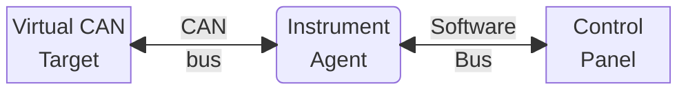

# Tutorial Step 8: Instrument Agent Primer (ISO Variant)

Coming to the end of this tutorial journey, this final example will bring
together several of the concepts introduced in prior tutorial examples to
implement an application that represents a device before the common software
bus. In other words, a very basic instrument agent. Since the agent existing in
isolation is not very useful, it will be combined with pre-built components that
bookend a software system. The following diagram depicts the overall
architecture of the software system the agent will exist in:



## Provided Components

The **Virtual CAN Target** and **Control Panel** components will be
provided and ready to use. Their individual purpose in the system is as
follows:

* The **Virtual CAN Target** will act as a device on the CAN bus, using the
  Virtual CAN bus used in [Step 4](./step_4.md) of the tutorial. It will
  transmit CAN frames for three (3) numeric values and will accept commands for
  three (3) discrete switches. The device will have a text-based user interface
  serving as a "front panel" for developers to alter outgoing values and monitor
  incoming commands.
* The **Control Panel** will act as a Software Bus-based user interface
  application that will monitor the virtual CAN device numeric values (i.e., the
  "telemetry") as translated by the **Instrument Agent** and will issue commands
  over the software bus for the agent to translate for the virtual CAN device.
  The user interface will be text-based.

## Target Dialect

### CAN-bus Target Interface

The **Virtual CAN Target** will emit the following numeric values over CAN bus,
each in its own CAN frame, under the indicated CAN arbitration IDs (CAN ID for
short):

| CAN ID  | Format         | DLC | Range      |
| :------ | :------------- | :-- | :--------- |
| `0x100` | unsigned 8-bit | 1   | `[0, 100]` |
| `0x101` | unsigned 8-bit | 1   | `[0, 100]` |
| `0x102` | unsigned 8-bit | 1   | `[0, 100]` |

The device will also accept discrete commands destined for virtual ON/OFF
actuators in CAN frames identified by the following CAN IDs:

| CAN ID  | Format         | DLC | Value    | Action   |
| :------ | :------------- | :-- | :------- | :------- |
| `0x200` | unsigned 8-bit | 1   | `!= 255` | Turn OFF |
| `0x200` | unsigned 8-bit | 1   | `== 255` | Turn ON  |
| `0x201` | unsigned 8-bit | 1   | `!= 255` | Turn OFF |
| `0x201` | unsigned 8-bit | 1   | `== 255` | Turn ON  |
| `0x202` | unsigned 8-bit | 1   | `!= 255` | Turn OFF |
| `0x202` | unsigned 8-bit | 1   | `== 255` | Turn ON  |

> [!NOTE]
> Why is the distribution of values between command states so lopsided?
>
> It would have been easy enough to assign value `0` as OFF and `1` as ON.
> However, in hardware interface design there are times when a specific
> actuator nominal (or "safe") position is shown preference. This example
> assumes that the switch OFF position is the safe, nominal state. Thus, the
> interface design requiring that moving the actuator to the ON position involve
> receiving a very specific value. Other value distributions would be just as
> valid, and would depend on the targeted hardware.

### Software Bus Interface

In the instrument agent, the above values will be translated by assigning
mnemonics (or "labels") to each. Those assigned labels will be featured in the
Software Bus-based interface the agent offers:

| CAN ID  | Label     |
| :------ | :-------- |
| `0x100` | `alpha`   |
| `0x101` | `bravo`   |
| `0x102` | `charlie` |
| `0x200` | `sw0`     |
| `0x201` | `sw1`     |
| `0x202` | `sw2`     |

Fresh off of completing [Step 7a](./step_7a.md) of the tutorial, the names
`alpha`, `bravo`, and `charlie` (other than being part of the aeronautical
phonetic alphabet) should seem familiar: they are the names used in the
`EngineeringData` message structure in the
[software bus topic configuration](./step_7a.md#software-bus-topic-configuration).
Indeed, one of the primary tasks of the instrument agent will be to collect
(or "acquire") incoming values over the aforementioned CAN IDs, collate them,
and emit them in `EngineeringData` topic samples.

The commands are not as obvious of a connection, since the `Command` topic
message structure only bears a character string field called `statement`. The
way the instrument agent will map the labels to the command messages is by
defining a very simple grammar describing the command text structure:

```bnf
<statement> ::= <target> <action>
<target>    ::= "sw0" | "sw1" | "sw2"
<action>    ::= "OFF" | "ON"
```

Thus, based on that grammar, a command statement that turns off `sw0` would look
like:

```
sw0 OFF
```

A command statement that turn on `sw1` would look like:

```
sw1 ON
```

## Supporting Library Bootstrap

Both the **Virtual CAN Target** and **Control Panel** applications provide a
text-based user interface implemented using the [NCURSES][ncurses_doc] library.
To more efficiently implement the applications, a separate utility library was
written that simplifies using [NCURSES][ncurses_doc]. Copy the code for this
library to the folder containing all other tutorial examples as follows (this
assumes the `FOUNDATION_ROOT` environment variable contains the location to the
Foundation project tree):

```console
$ rsync -auv ${FOUNDATION_ROOT}/examples/NcursesKit .
```

## Virtual CAN Target Bootstrap

The code that implements the **Virtual CAN Target** is already provided in the
Foundation project tree and can be copied over to the directory containing all
other tutorial examples as follows (this assumes the `FOUNDATION_ROOT`
environment variable contains the location to the Foundation project tree):

```console
$ rsync -auv ${FOUNDATION_ROOT}/examples/VirtualCanTarget .
```

## Control Panel Bootstrap

The code that implements the **Control Panel** (ISO Variant) is already
provided in the Foundation project tree and can be copied over to the directory
containing all other tutorial examples as follows (this assumes the
`FOUNDATION_ROOT` environment variable contains the location to the Foundation
project tree):

```console
$ rsync -auv ${FOUNDATION_ROOT}/examples/IsoControlPanel .
```

## Example Application Bootstrap

The instrument agent that will be built in this tutorial step bears enough of
a resemblance to the application written in [Step 7](./step_7.md) that its
starting point can be where Step 7 finished. From the directory containing all
other tutorial examples, most importantly the `TutorialStep7` and
`MySoftwareBus` project directories, execute the following:

```console
$ mkdir TutorialStep8a
$ cd TutorialStep8a
$ rsync -auv --exclude 'build/' --exclude 'compile_commands.json' ../TutorialStep7a/ .
```

## NCurses Library Build

Normally, building of code is left to the end of the example steps, but the
packages that support the example application can be built "a-priori." For the
[NCURSES][ncurses_doc] library, starting from the root folder as copied over in
[the corresponding bootstrapping section](#supporting-library-bootstrap),
execute the following:

```console
$ mkdir build
$ cd build
$ cmake -DCMAKE_BUILD_TYPE=Debug -DCMAKE_CXX_COMPILER=clang++ -G Ninja ..
$ ninja
```

## Virtual CAN Target Build

Starting from the root folder as copied over when the
[**Virtual CAN Target** project tree was bootstrapped](#virtual-can-target-bootstrap),
execute the following (this assumes the `FOUNDATION_ROOT` environment variable
contains the location to the Foundation project tree):

```console
$ mkdir build
$ cd build
$ cmake -DCMAKE_BUILD_TYPE=Debug \
  -DCMAKE_CXX_COMPILER=clang++ \
  -DCMAKE_PREFIX_PATH="/opt/iceoryx/2.95.0;/opt/cyclonedds/0.10.5" \
  -DNcursesKit_DIR=$(readlink -f ../../NcursesKit/build/NcursesKit) \
  -DFoundation_DIR=${FOUNDATION_ROOT}/build/Foundation \
  -G Ninja \
  ..
$ ninja
```

> [!NOTE]
> Even though the **Virtual CAN Target** does not use DDS, it links against a
> Foundation build that *does* include DDS ([Cyclone DDS][CycloneDDS] in this
> case). Thus, all required DDS provider settings must be provided when
> configuring the build tree. In the case of [Cyclone DDS][CycloneDDS], that
> means providing the necessary value to `CMAKE_PREFIX_PATH`.

## Control Panel Build

Starting from the root folder as copied over when the
[**Control Panel** project tree was bootstrapped](#control-panel-bootstrap),
execute the following (this assumes the `FOUNDATION_ROOT` environment variable
contains the location to the Foundation project tree):

```console
$ mkdir build
$ cd build
$ cmake -DCMAKE_BUILD_TYPE=Debug \
  -DCMAKE_CXX_COMPILER=clang++ \
  -DCMAKE_PREFIX_PATH="/opt/iceoryx/2.95.0;/opt/cyclonedds/0.10.5" \
  -DNcursesKit_DIR=$(readlink -f ../../NcursesKit/build/NcursesKit) \
  -DFoundation_DIR=${FOUNDATION_ROOT}/build/Foundation \
  -DMyIsoSoftwareBus_DIR=$(readlink -f ../../MyIsoSoftwareBus/build/MyIsoSoftwareBus) \
  -G Ninja \
  ..
$ ninja
```

## Application Project Build Configuration

Similar to the other examples, this example application must be given a unique
name. Furthermore, the project dependency list must be updated to include
support for CAN Bus. In the `TutorialStep8a` directory, edit the project metadata in
the `CMakeLists.txt` `project()` command as follows:

```diff
- project(IsoSoftwareBusPrimer LANGUAGES CXX)
+ project(IsoVctAgent LANGUAGES CXX)
```

Then, update the project dependencies in the `find_package()` command:

```diff
-find_package(Foundation REQUIRED CoreKit IsoDdsKit)
+find_package(Foundation REQUIRED COMPONENTS CoreKit CanBusKit IsoDdsKit)
```

Finally, include the required components in the `target_link_libraries()`
command as follows:

```diff
-target_link_libraries(${PROJECT_NAME} Foundation::CoreKit Foundation::IsoDdsKit MyIsoSoftwareBus::MyIsoSoftwareBus)
+target_link_libraries(${PROJECT_NAME} Foundation::CoreKit Foundation::CanBusKit Foundation::IsoDdsKit MyIsoSoftwareBus::MyIsoSoftwareBus)
```

## Application Main Function

There are very little changes required of the main function, just like in
[Step 1](./step_1.md). The change involves altering the application name for
logging purposes in the call to `::CoreKit::Application::initialize()`. From the
`TutorialStep8a` project folder modify the `src/main.cpp` file as follows:

```diff
-G_MyApp->initialize("IsoSoftwareBusPrimer", argc, argv);
+G_MyApp->initialize("IsoVctAgent", argc, argv);
```

## Application Delegate

### Class Structure Customization

Normally, on anything but a basic application, a lot of the logic is written
away from the application delegate (as shown in [Step 6](./step_6.md)). In this
case, however, to keep things easy to explain, all of the custom application
logic will remain in the delegate class. From the `TutorialStep8a` project root
folder, make the following changes to the top of the `MyAppDelegate` class
definition in the `src/MyAppDelegate.h` file:

```diff
#include <memory>
#include <random>
#include <string>
#include <CoreKit/CoreKit.h>
+#include <CanBusKit/CanBusKit.h>
#include <IsoDdsKit/IsoDdsKit.h>
#include <MyIsoSoftwareBus.h>

class MyAppDelegate : public IsoDdsKit::DdsEnabledAppDelegate, public CoreKit::InterruptListener
{
```

Next, towards the end of the `MyAppDelegate` class definition, make the
following changes in the `src/MyAppDelegate.h` file:

```diff
    virtual void applicationDidTerminate(CoreKit::Application *theApp) override;

    virtual void timerExpired(int timerId) override;

-   void onEngineeringData(MyIsoSoftwareBus::EngineeringData const& sample);
+   void onCanBusFrame(CanBusKit::CanBusFrameNotification *canNotif);
+
+   void onCommand(MyIsoSoftwareBus::Command const& cmdSample);

private:
-   using EngrDataReaderContextPtr = std::shared_ptr< IsoDdsKit::ReaderContext< MyIsoSoftwareBus::EngineeringData > >;
    using EngrDataWriterContextPtr = std::shared_ptr< IsoDdsKit::WriterContext< MyIsoSoftwareBus::EngineeringData > >;
+   using CommandReaderContextPtr = std::shared_ptr< IsoDdsKit::ReaderContext< MyIsoSoftwareBus::Command > >;

-   std::uniform_int_distribution< int > m_distr;
-   EngrDataReaderContextPtr m_engrDataReaderContext;
    EngrDataWriterContextPtr m_engrDataWriterContext;
+   CommandReaderContextPtr m_commandReaderContext;
-   std::random_device m_rng;
-   bool m_subscriberMode;
    int m_timerId;
+   std::unique_ptr< CanBusKit::CanBusIo > m_canIf;
+   std::string m_canIfName;
+   MyIsoSoftwareBus::EngineeringData m_currentValues;
};
```

Both the set of changes shown accomplish the following:

* Alter the application definition so that instead of preparing to receive
  `MyIsoSoftwareBus::EngineeringData` samples from the software bus, it
  prepares to receive `MyIsoSoftwareBus::Command` samples, presumably from the
  **Control Panel** application (although it can be from any software bus
  participant): the `onCommand()` method.
* Prepare to receive CAN bus frames, presumably from the **Virtual CAN Target**
  application: the `onCanBusFrame()` method.
* Add an instance field definition for the CAN bus interface: `m_canIf` field.
* Add an instance field to hold the name of the CAN bus interface: `m_canIfName`
  field.
* Add an instance field definition for the `MyIsoSoftwareBus::Command` reader
  context: `m_commandReaderContext` field.
* Create an instance field to hold the last observed values for all data points:
  `m_currentValues` field.

### Implementation File Preamble

In order to prepare the implementation of the `MyAppDelegate` class, modify the
following content at the beginning of the `src/MyAppDelegate.cpp` file:

```diff
+#include <algorithm>
#include <cstdlib>
#include <functional>
+#include <iterator>
+#include <regex>
#include <sstream>
#include <stdexcept>
#include <vector>

#include "MyAppDelegate.h"


+using CanBusKit::CanBusFrameNotification;
+using CanBusKit::CanBusIo;
+using CanBusKit::newCanBusFrameCallback;
using CoreKit::AppLog;
using CoreKit::Application;
using CoreKit::EndLog;
using CoreKit::G_MyApp;
using IsoDdsKit::DdsEnabledAppDelegate;
+using MyIsoSoftwareBus::Command;
using MyIsoSoftwareBus::EngineeringData;

namespace
{
+   // Command-Line Flag Names
+   const char *CAN_IF_FLAG = "can-if";
-   const char *SUBSCRIBER_FLAG = "subscriber";
+   // CAN ID definitions
+   constexpr canid_t ALPHA_CAN_ID = 0x100;
+   constexpr canid_t BRAVO_CAN_ID = 0x101;
+   constexpr canid_t CHARLIE_CAN_ID = 0x102;
+   constexpr canid_t SW0_CAN_ID = 0x200;
+   constexpr canid_t SW1_CAN_ID = 0x201;
+   constexpr canid_t SW2_CAN_ID = 0x202;
}
```

The above changes add all necessary namespace imports and customize the
command line flag names to be able to receive the name of the CAN bus interface
to use. The changes also add constant definitions for the CAN bus IDs that will
be used to interact with the **Virtual CAN Target**.

Next, modify the constructor implementation for the `MyAppDelegate` class as
follows in the `src/MyAppDelegate.cpp` file:

```diff
MyAppDelegate::MyAppDelegate():
-   m_subscriberMode(false),
-   m_timerId(-1),
-   m_distr(0, 100)
+   m_timerId(-1)
{
+   m_currentValues.alpha(0);
+   m_currentValues.bravo(0);
+   m_currentValues.charlie(0);
}
```

The changes to the constructor simply initialize the values of the instance
field to nominal.

### Command Line Configuration

After that, alter the implementation of the `configureCmdLineArgs()` method in
the `src/MyAppDelegate.cpp` file as follows:

```diff
void
MyAppDelegate::configureCmdLineArgs(Application *theApp)
{
    DdsEnabledAppDelegate::configureCmdLineArgs(theApp);

-   theApp->addCmdLineArgDef(
-       Application::CmdLineArg(
-           SUBSCRIBER_FLAG,
-           false,
-           "If present, start the application in subscriber mode; start in publisher mode if absent."
-       )
-   );
+   theApp->addCmdLineArgDef(
+       Application::CmdLineArg(
+           CAN_IF_FLAG,
+           true,
+           "Name of the CAN bus interface to use."
+       )
+   );
}
```

The above changes configure the `--can-if` command-line flag to accept the name
of the CAN bus interface the application will use.

### Application Initialization

Next, replace the implementation for the application initialization method
`applicationDidInitialize()` as follows in the `src/MyAppDelegate.cpp` class:

```c++
void
MyAppDelegate::applicationDidInitialize(Application *theApp)
{
    DdsEnabledAppDelegate::applicationDidInitialize(theApp);

    m_canIfName = theApp->getCmdLineArgFor(CAN_IF_FLAG);
    if (m_canIfName.empty())
    {
        throw std::runtime_error("Must specify a CAN bus interface name.");
    }
    m_canIf.reset(new CanBusIo(m_canIfName, theApp->getMainRunLoop()));

    topics().add< MyIsoSoftwareBus::Command >(participant(), "Command");
    topics().add< MyIsoSoftwareBus::EngineeringData >(participant(), "EngineeringData");

    auto cmdQos = subscriber().default_datareader_qos();
    cmdQos << dds::core::policy::Reliability::Reliable()
           << dds::core::policy::History::KeepLast(10);
    m_commandReaderContext = createReaderContext< MyIsoSoftwareBus::Command >("Command", cmdQos);

    auto engrDataQos = publisher().default_datawriter_qos();
    engrDataQos << dds::core::policy::Reliability::BestEffort()
                << dds::core::policy::History::KeepLast(100);
    m_engrDataWriterContext = createWriterContext< MyIsoSoftwareBus::EngineeringData >("EngineeringData", engrDataQos);

    theApp->log() << AppLog::LL_INFO << "Opened domain participant to domain (" << participant().domain_id() << ")" << EndLog;
}
```

The above implementation processes the incoming CAN bus interface name via the
command line, foregoing the logic that was originally put in to implement the
different operating modes of [Step 7a](./step_7a.md). The interface name is
then used to create the `CanBusKit::CanBusIo` instance that will be used to
exchange messages (frames) over the CAN bus. The implementation also sets up
the required DDS infrastructure, including the reader and writer contexts for
the `Command` and `EngineeringData` topics.

### Application Start

Replace the `MyAppDelegate::applicationStarting()` method implementation in the
`src/MyAppDelegate.cpp` file as follows:

```c++
void
MyAppDelegate::applicationStarting(Application *theApp)
{
    std::stringstream errorMsg;

    if (!m_canIf)
    {
        errorMsg << "Attempting to start without CAN bus interface.";
        throw std::runtime_error(errorMsg.str());
    }

    if (!m_commandReaderContext)
    {
        errorMsg << "Precondition [Command Reader Context Configured] not met.";
        throw std::runtime_error(errorMsg.str());
    }

    if (!m_engrDataWriterContext)
    {
        errorMsg << "Precondition [Engineering Data Writer Configured] not met.";
        throw std::runtime_error(errorMsg.str());
    }

    m_canIf->addCanFrameCallback(
        newCanBusFrameCallback(
            std::bind(
                std::mem_fn(&MyAppDelegate::onCanBusFrame),
                this,
                std::placeholders::_1
            )
        )
    );
    m_canIf->startCan();

    m_commandReaderContext->sampleDistribution().addListener(
        std::bind(
            std::mem_fn(&MyAppDelegate::onCommand),
            this,
            std::placeholders::_1
        )
    );
    m_commandReaderContext->activate(theApp->getMainRunLoop());

    m_engrDataWriterContext->activate(theApp->getMainRunLoop());
    m_timerId = theApp->getMainRunLoop()->registerTimerWithInterval(1.0, this, true);
}
```

The above changes again mostly remove the logic that allowed the test
application written in [Step 7a](./step_7a.md) to run in two (2) modes. This
application firmly operates in a single mode: accepting
`MyIsoSoftwareBus::Command` samples from the software bus and transmitting
`MyIsoSoftwareBus::EngineeringData` samples. The data samples are published at
the beat of a timer, also set up in this method logic. The method also enables
the CAN bus interface and registers an event handler for any incoming CAN bus
frames.

> [!NOTE]
> Why not publish `EngineeringData` every time there's an update?
>
> It is certainly possible to alter the design of the application so that every
> time a new data point arrives via the CAN bus, the example agent application
> emits a new `EngineeringData` sample. In this particular case, however, since
> the target device emits *all* data points as a batch on the regular, sending
> a new `EngineeringData` sample carrying all three (3) data points when only
> a fresh sample for one was received would be wasteful. Alternative logic would
> either have the agent wait for fresh samples on all data points before
> emitting an `EngineeringData` sample of its own. Yet another alternative would
> have the agent only emitting `EngineeringData` samples whenever a
> *value change* (not necessarily a fresh sample) is observed. All alternatives
> bring with them a set of pros and cons that application and system designers
> will need to consider.

### Application Pre-Termination

Replace the `applicationWillTerminate()` method implementation in the
`src/MyAppDelegate.cpp` file with the following content:

```c++
void
MyAppDelegate::applicationWillTerminate(Application *theApp)
{
    if (m_timerId != -1)
    {
        theApp->getMainRunLoop()->deregisterTimer(m_timerId);
        m_timerId = -1;
    }

    if (m_engrDataWriterContext)
    {
        m_engrDataWriterContext->deactivate(theApp->getMainRunLoop());
    }

    if (m_commandReaderContext)
    {
        m_commandReaderContext->deactivate(theApp->getMainRunLoop());
    }
    
    if (m_canIf)
    {
        m_canIf->stopCan();
    }
}
```

Just like in previous examples, this method logic simply tears down any active
components in the application in preparation for shutdown.

### Application Post-Termination

Similar to [Step 7a](./step_7a.md), once the main run loop exits the only thing
left to do is to release any resources. Replace the implementation of the
`applicationDidTerminate()` method in the `src/MyAppDelegate.cpp` file as
follows:

```c++
void
MyAppDelegate::applicationDidTerminate(Application *theApp)
{
    m_engrDataWriterContext.reset();
    m_commandReaderContext.reset();
    m_canIf.reset();

    DdsEnabledAppDelegate::applicationDidTerminate(theApp);
}
```

### Timer Expiration Handler

The example agent is designed to publish `EngineeringData` at regular intervals
based on a timer. The method publishes a new sample whether it received fresh
data over the CAN bus or not. Replace the `timerExpired()` method implementation
in the `src/MyAppDelegate.cpp` file with the following:

```c++
void
MyAppDelegate::timerExpired(int timerId)
{
    G_MyApp->log() << AppLog::LL_INFO << "Sending sample: " << EngineeringDataToString(m_currentValues) << EndLog;
    m_engrDataWriterContext->writer().write(m_currentValues);
}
```

### CAN Bus Data Handler

The agent will receive fresh samples for the target's data points via CAN bus
notifications, which will arrive at the `onCanBusFrame()` method. Add the
following implementation to it in the `src/MyAppDelegate.cpp` file:

```c++
void
MyAppDelegate::onCanBusFrame(CanBusFrameNotification *canNotif)
{
    switch(canNotif->canId)
    {
    case ALPHA_CAN_ID:
        m_currentValues.alpha(canNotif->canPayload[0]);
        break;
    
    case BRAVO_CAN_ID:
        m_currentValues.bravo(canNotif->canPayload[0]);
        break;
    
    case CHARLIE_CAN_ID:
        m_currentValues.charlie(canNotif->canPayload[0]);
        break;
    }
}
```

The implementation for incoming CAN bus data simply stores the incoming sample
into the cache that will be used to publish an `EngineeringData` sample in the
[timer expiration method](#timer-expiration-handler).

> [!NOTE]
> In order to keep things simple, this code is quite cavalier as it comes to
> accepting samples from the device. A more robust application would have the
> sample ingest perform some cursory checks (e.g., are there any flags set, is
> the payload the correct size for the ID, etc.).

### Software Bus Command Handler

Another job of the agent is to translate commands arriving from the software bus
to messages that the target will understand. Add the following implementation
for the `onCommand()` method in the `src/MyAppDelegate.cpp` class:

```c++
void
MyAppDelegate::onCommand(Command const& cmdSample)
{
    static const std::map< std::string, canid_t > TARGETS(
        {
            { "sw0", SW0_CAN_ID },
            { "sw1", SW1_CAN_ID },
            { "sw2", SW2_CAN_ID }
        }
    );
    static const std::map< std::string, std::uint8_t > ACTIONS(
        {
            { "OFF", 0u },
            { "ON", 255u }
        }
    );

    struct can_frame canCmd;

    memset(&canCmd, 0x00, sizeof(can_frame));

    std::regex whitespaceSep("\\s+");
    std::vector< std::string > commandTokens;
    std::string commandStatement = cmdSample.statement();
    std::copy(
        std::sregex_token_iterator(
            commandStatement.begin(),
            commandStatement.end(),
            whitespaceSep,
            -1
        ),
        std::sregex_token_iterator(),
        std::back_inserter(commandTokens)
    );
    if (commandTokens.size() != 2u)
    {
        G_MyApp->log() << AppLog::LL_WARNING
            << "Not enough tokens in command \""
            << commandStatement
            << "\". Expecting two (2)"
            << EndLog;
        return;
    }
    auto targetIter = TARGETS.find(commandTokens[0]);
    if (TARGETS.end() == targetIter)
    {
        G_MyApp->log() << AppLog::LL_WARNING
            << "Unknown command target \""
            << commandTokens[0]
            << "\"."
            << EndLog;
        return;
    }
    auto actionIter = ACTIONS.find(commandTokens[1]);
    if (ACTIONS.end() == actionIter)
    {
        G_MyApp->log() << AppLog::LL_WARNING
            << "Unknown command action \""
            << commandTokens[1]
            << "\"."
            << EndLog;
        return;
    }

    G_MyApp->log() << AppLog::LL_INFO
        << "Processing command statement: "
        << commandStatement
        << EndLog;
    canCmd.can_id = (*targetIter).second;
    canCmd.can_dlc = 1;
    canCmd.data[0] = (*actionIter).second;

    m_canIf->sendCanFrame(&canCmd);
}
```

The implementation of the handler certainly looks long, but when broken down
by work done it is not difficult to cover:

* Using the C++11 regular expression library, the method breaks down the command
  string per the grammar specified in the
  [Software Bus Interface](#software-bus-interface) section.
* If either the command target or the action are unrecognized, a warning message
  is added to the log and the method exits.
* Otherwise, the target is translated to its appropriate CAN ID and the action
  to its appropriate frame payload content.
* Then, the CAN bus frame is sent out.

### Engineering Data Handler Remove

The delegate implementation in [Step 7a](./step_7a.md#incoming-sample-handler)
added an event handler for incoming `EngineeringData` samples, but this
application does not listen for those, so that implementation must be removed
from the `src/MyAppDelegate.cpp` file:

```diff
-void
-MyAppDelegate::onEngineeringData(EngineeringData const& sample)
-{
-   G_MyApp->log() << AppLog::LL_INFO << "Received sample: " << EngineeringDataToString(sample) << EndLog;
-}
```

## Building The Application

Just like the
[application build process in Step 7a](./step_7a.md#building-the-application),
this example application must be instructed where to find the `MyIsoSoftwareBus`
package. From the `TutorialStep8a` project directory, execute the following
statements to configure the application build tree:

```console
$ mkdir build
$ cd build
$ cmake -DCMAKE_BUILD_TYPE=Debug \
  -DCMAKE_EXPORT_COMPILE_COMMANDS=ON \
  -DCMAKE_CXX_COMPILER=clang++ \
  -DCMAKE_PREFIX_PATH="/opt/iceoryx/2.95.0;/opt/cyclonedds/0.10.5" \
  -DFoundation_DIR=${FOUNDATION_ROOT}/build/Foundation \
  -DMyIsoSoftwareBus_DIR=$(readlink -f ../../MyIsoSoftwareBus/build/MyIsoSoftwareBus) \
  -G Ninja ..
```

After the build tree is set up, run the build as follows:

```console
$ ninja
```

## Running

### Running the Example Application

The example application is able to run on its own without any other entities
present either in the CAN bus or in the software bus, although it does not do
anything interesting like that; it merely provides regular 1Hz updates on
unchanging data points:

```console
$ ./IsoVctAgent --can-if vcan0 --dds-domain 30
[2024-09-18T21:30:58.040Z] [IsoVctAgent] [1725335] [INFORMATION]: Opened domain participant to domain (30)
[2024-09-18T21:30:59.055Z] [IsoVctAgent] [1725335] [INFORMATION]: Sending sample: { "alpha": 0, "bravo": 0, "charlie": 0 }
[2024-09-18T21:31:00.055Z] [IsoVctAgent] [1725335] [INFORMATION]: Sending sample: { "alpha": 0, "bravo": 0, "charlie": 0 }
[2024-09-18T21:31:01.055Z] [IsoVctAgent] [1725335] [INFORMATION]: Sending sample: { "alpha": 0, "bravo": 0, "charlie": 0 }
[2024-09-18T21:31:02.055Z] [IsoVctAgent] [1725335] [INFORMATION]: Sending sample: { "alpha": 0, "bravo": 0, "charlie": 0 }
[2024-09-18T21:31:03.055Z] [IsoVctAgent] [1725335] [INFORMATION]: Sending sample: { "alpha": 0, "bravo": 0, "charlie": 0 }
```

### Running a Subscribing Entity

The example application used in [Step 7a](./step_7a.md#running-the-subscriber), in
subscriber mode, can be used to confirm proper `EngineeringData` publishing,
though. With the `VctAgent` application running in its own terminal window, open
a new terminal shell session and run the example application in subscriber mode
to verify the software bus traffic:

```console
$ ./IsoSoftwareBusPrimer --dds-domain=30 --subscriber
[2024-09-18T21:31:56.403Z] [IsoSoftwareBusPrimer] [1725376] [INFORMATION]: Set application to subscriber mode.
[2024-09-18T21:31:56.403Z] [IsoSoftwareBusPrimer] [1725376] [INFORMATION]: Opened domain participant to domain (30)
[2024-09-18T21:31:57.310Z] [IsoSoftwareBusPrimer] [1725376] [INFORMATION]: Received sample: { "alpha": 0, "bravo": 0, "charlie": 0 }
[2024-09-18T21:31:58.310Z] [IsoSoftwareBusPrimer] [1725376] [INFORMATION]: Received sample: { "alpha": 0, "bravo": 0, "charlie": 0 }
[2024-09-18T21:31:59.310Z] [IsoSoftwareBusPrimer] [1725376] [INFORMATION]: Received sample: { "alpha": 0, "bravo": 0, "charlie": 0 }
[2024-09-18T21:32:00.310Z] [IsoSoftwareBusPrimer] [1725376] [INFORMATION]: Received sample: { "alpha": 0, "bravo": 0, "charlie": 0 }
[2024-09-18T21:32:01.310Z] [IsoSoftwareBusPrimer] [1725376] [INFORMATION]: Received sample: { "alpha": 0, "bravo": 0, "charlie": 0 }
[2024-09-18T21:32:02.310Z] [IsoSoftwareBusPrimer] [1725376] [INFORMATION]: Received sample: { "alpha": 0, "bravo": 0, "charlie": 0 }
```

### Running the Virtual CAN Target

When paired with the **Virtual CAN Target**, however, things start to look a
little more interesting. In yet another terminal window, with the shell current
directory set to the `VirtualCanTarget` project build tree, start the
`VirtualCanTarget` application by issuing the command:

```console
$ ./VirtualCanTarget --can-if vcan0
```

The application will take over the terminal window and present a text-based user
interface showing three (3) vertical sliders labeled `ALPHA`, `BRAVO`, and
`CHARLIE`, as well as three (3) indicators labeled `SW0`, `SW1`, and `SW2`.

```

 ┌───────┐ ┌───────┐ ┌───────┐ ┌───┐
 │ ALPHA │ │ BRAVO │ │CHARLIE│ │SW0│
 │       │ │       │ │       │ └───┘
 │       │ │       │ │       │
 │       │ │       │ │       │
 │       │ │       │ │       │ ┌───┐
 │       │ │       │ │       │ │SW1│
 │       │ │       │ │       │ └───┘
 │       │ │       │ │       │
 │       │ │       │ │       │
 │       │ │       │ │       │ ┌───┐
 │       │ │       │ │       │ │SW2│
 │       │ │       │ │       │ └───┘
 │       │ │       │ │       │
 │       │ │       │ │       │
 │       │ │       │ │       │
 │       │ │       │ │       │
 │      0│ │      0│ │      0│
 └───────┘ └───────┘ └───────┘


Press [Q] to exit.
```

The vertical sliders can be used to alter the telemetry value of the data point
corresponding to its label on the CAN bus. Use the ↑ (up arrow) or ↓
(down arrow) keys to update the associated value (shown in the bottom of the
slider control). As the values in the control are updated, their corresponding
values in the CAN bus are updated as well. Navigating between the three (3)
sliders is possible via the `[TAB]` key.

The indicators reflect the last commanded state for each. Whenever the
**Virtual CAN Target** application receives a CAN message with the appropriate
CAN ID (refer to the [Target Dialect](#target-dialect) section), the indicator
will either illuminate or darken. Since the indicators are not controls, they
cannot be traversed via keyboard navigation as the vertical sliders are.

Pressing the `Q` key at any time exits the application and restores the terminal
window to its previous state.

### Running the Control Panel

Completing the solution architecture laid out
[at the introduction](#tutorial-step-8-instrument-agent-primer-iso-variant)
is the **Control Panel** application. In another terminal window, with the
shell current working directory on the `IsoControlPanel` build tree, start the
`IsoControlPanel` application by issuing the command:

```console
$ ./IsoControlPanel --dds-domain=30
```

Like the **Virtual CAN Target**, the application will take over the terminal
window and present a text-based user interface with three (3) vertical gauges
labeled `ALPHA`, `BRAVO`, and `CHARLIE`, and three (3) toggle buttons labeled
`SW0`, `SW1`, and `SW2`:

```

 ┌───────┐ ┌───────┐ ┌───────┐ ┌──────────┐
 │ ALPHA │ │ BRAVO │ │CHARLIE│ │   SW0    │
 │       │ │       │ │       │ │          │
 │       │ │       │ │       │ │ OFF  ON  │
 │       │ │       │ │       │ │          │
 │       │ │       │ │       │ └──────────┘
 │       │ │       │ │       │
 │       │ │       │ │       │ ┌──────────┐
 │       │ │       │ │       │ │   SW1    │
 │       │ │       │ │       │ │          │
 │       │ │       │ │       │ │ OFF  ON  │
 │       │ │       │ │       │ │          │
 │       │ │       │ │       │ └──────────┘
 │       │ │       │ │       │
 │       │ │       │ │       │ ┌──────────┐
 │       │ │       │ │       │ │   SW2    │
 │       │ │       │ │       │ │          │
 │      0│ │      0│ │      0│ │ OFF  ON  │
 └───────┘ └───────┘ └───────┘ │          │
                               └──────────┘


Press [Q] to exit.
```

The vertical gauges reflect the last value observed in the software bus for the
corresponding data points. The toggle buttons can be switched on and off using
the `[SPACE]` key. Navigation through the available buttons is possible via the
`[TAB]` key. Pressing `Q` will exit the application.

With the entire system up and running (`VirtualCanTarget`, `VctAgent`, and
`IsoControlPanel`) it is now possible to observe how the system reacts to
"telemetry" from the virtual device, and how it handles command requests. From
the terminal window running `VirtualCanTarget`, manipulate the values in the
`ALPHA`, `BRAVO`, or `CHARLIE` sliders. As the values update in the
`VirtualCanTarget` front panel they should be reflected in the terminal window
showing the `IsoControlPanel` application. The updates will seem to lag, and that
lag is due to the 1Hz "sampling rate" present in both the CAN target and the
agent.

Next, navigate to the terminal window running `IsoControlPanel` and start toggling
the buttons there. Unlike the data point "telemetry" that is reported at a fixed
interval, commands are dispatched immediately, so there should not be much (if
any) discernible lag between toggling the buttons and the `VirtualCanTarget`
front panel indicators reacting.

## Conclusion

Congratulations! 🎉🎉 You have created a Foundation-based instrument agent that
represents a device, albeit virtual, on a DDS-based software bus. The agent
translates telemetry incoming from the device via CAN bus into `EngineeringData`
software bus samples visible to other software bus participants (like
`IsoControlPanel` and even the `IsoSoftwareBusPrimer` application written in
[Step 7a](./step_7a.md)). The agent also reacts to commands from an operator (in
this case, sent via the `IsoControlPanel` application) and translates them to the
proper CAN bus message for the device.

[CycloneDDS]: https://cyclonedds.io/ "Cyclone DDS"
[ncurses_doc]: https://tldp.org/HOWTO/NCURSES-Programming-HOWTO/ "TDLP NCURSES Programming HOWTO"
